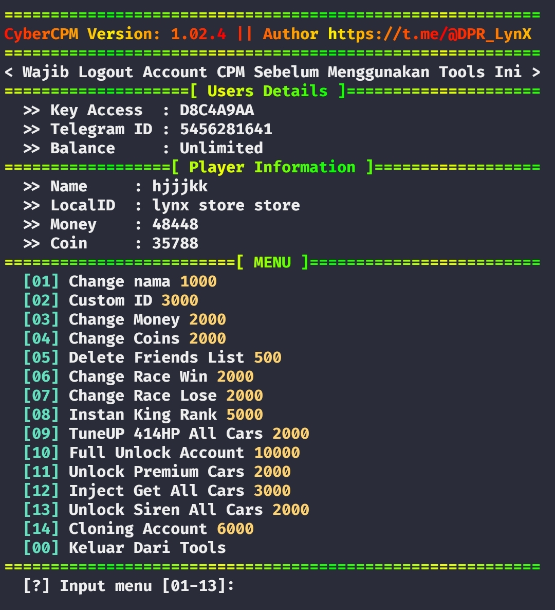

# CyberCPM
<h3>CyberCPM is a tool made to modify Car Parking Multiplayer accounts with no root or virtuall app.</h3>
<h4>you just need an Access Key, wich you can get from <a href="https://t.me/CyberCPMbot">@CyberCPMbot</a> for free with 1K Credits Balance.</h4>



#### Tested on:
- IPhone (**ish**).
- Android (**Termux**).
- Windows
- Linux

## Installation
[don't know how to install python ?](#install-python)
```
git clone https://github.com/CyberCPM/cybercpm.git
```
```
cd cybercpm
```
```
pip install -r requirements.txt
```
```
pip install gitpython
```
```
pip install colorama
```
```
pip install progressbar2
```
```
python main.py
```
```

## install python

- ### Termux
    - `apt update && apt upgrade -y`
    - `pkg install python -y`
    - `pkg install python-pip`

- ### Linux
    - `sudo apt install python`
    - `sudo apt install python-pip`

- ### Windows
    - Download python3 form [python.org](https://www.python.org/downloads/).
    - if **pip** is not in **PATH** use: `py -3 -m pip install -r requirements.txt`
    - `py -3 main.py`
